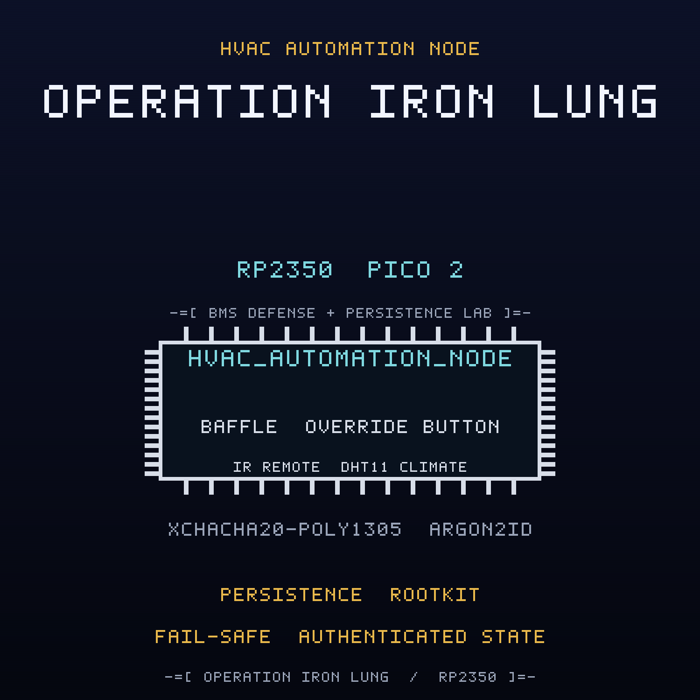

<br>

## FREE Reverse Engineering Self-Study Course [HERE](https://github.com/mytechnotalent/reverse-engineering)
## FREE Embedded Hacking Course [HERE](https://github.com/mytechnotalent/Embedded-Hacking)

<br>

# OPERATION IRON LUNG CTF

### Act IV - The compromised HVAC automation node

<br>

***
**LEGAL DISCLAIMER:**
The information, tools, and code provided in this repository and course are strictly for educational, research, and defensive purposes only. 

You are explicitly prohibited from using any materials contained herein to access, test, modify, or exploit any device, network, or system that you do not own 100% or for which you do not have explicit, documented, and legally binding authorization to interact with.

By using this repository and course, you acknowledge and agree that:

1. Any illegal, unauthorized, or malicious use of this information is solely your responsibility.
2. The author(s) and contributor(s) of this repository and course shall not be held liable for any damages, legal repercussions, criminal charges, or unauthorized actions resulting from the use, misuse, or abuse of the contents herein.
3. You will comply with all applicable local, state, national, and international laws regarding cybersecurity and computer fraud.

**IF YOU DO NOT AGREE WITH THESE TERMS, DO NOT USE THIS REPOSITORY AND COURSE.**
***

<br>
<br>

> Hello again, friend.
>
> Act I was the lie. Act II was the door. Act III was the payload. This is the
> payload that refuses to die.
>
> WHITEOUT neutralized the valve implant. The crew erased the payload sector,
> patched the re-install check, reflashed the controller, and watched it come
> back. Not on the same board. On the next one. The HVAC automation node that
> feeds the clean room where NorthPharma compounds the cold medicine, and the
> implant had already learned the lesson of the last act.
>
> It hides a copy of itself in a reserved flash sector. On every boot it reads
> that sector, finds its own marker, and re-installs the beacon and the bomb.
> You can reflash the firmware all day; the payload returns. It also wears a
> rootkit. It masks its own beacon from the BMS display and the maintenance
> log, so the operator reads a clean node while the radio is still talking.
>
> NorthPharma is the Ministry's front. FROSTLINE wrote the persistence.
>
> Do not trust the clean screen. Read the reserved sector. Then remove it for
> good.
>
> The baffle is holding. That is exactly why you should be afraid.

This is the companion capture-the-flag to the
[hvac-automation-node](https://github.com/mytechnotalent/hvac-automation-node)
project. Where the project builds the defended node, this CTF hands you the
**compromised** image that FROSTLINE shipped and asks you to find every defect,
prove it on real hardware, and patch the image.

<br>

## THE MISSION

The `ACT-IV.bin` image is the OPERATION IRON LUNG HVAC automation node with
**four deliberate defects**. Each defect is an in-place, same-size byte patch, so
no address moves when you fix it. Every fix is provable on a Pico 2 with a Debug
Probe.

| # | Name | What FROSTLINE did |
| - | ---- | ------------------ |
| 1 | The Persistence Re-Install | inverted the re-install gate so a present reserved-sector marker re-arms the implant on every boot |
| 2 | The Rootkit Hiding | inverted the rootkit gate so the LCD reads `B:--` and the `BCN` log is suppressed while the beacon still transmits |
| 3 | The Reserved-Sector Write | inverted the persist gate so the first boot writes marker `0xC7` to reserved sector `0x103FF000` |
| 4 | The SETPOINT Authorization | inverted the authorization verdict so an unauthenticated or replayed SETPOINT envelope is accepted |

The wire is sealed with XChaCha20-Poly1305, keyed through Argon2id. The
cryptography is correct. Three of the four defects are not in the cipher at all:
they are an implant that lives on the same chip and survives the reflash that was
supposed to remove it. The fourth is a policy seam in the SETPOINT command path.
Read the dead, find the payload, and remove it for good.

<br>

## THE ARTIFACTS

| File | Role | SHA-256 |
| ---- | ---- | ------- |
| `ACT-IV.bin` | compromised firmware, the target | `efcb991c3114d51994aa0dc080bbcb592bc9432c7739b850eeb63e73e7e62316` |
| `ACT-IV.uf2` | flashable image of the target | `f7e79d0b0e3104e3ee0f3a2c032d9ba95da2d1128235ffa8b822d74c6b8542be` |
| `ACT-IV_fixed.bin` | corrected firmware, the solution | `7d59dc65e512c30630f51b20baf1c6e358ae54a024e88cfd8373d847ea170f7c` |
| `ACT-IV_fixed.uf2` | flashable image of the solution | `977c4cad1f60e05060fd933050ecc7c0f04e319cbee9c3c441c41c9e37137775` |

The two `.bin` files differ in exactly four bytes at offsets
`0x7581, 0xA2D1, 0xA42D, 0xA46F`, and both are 51,012 bytes. The UF2 images are
102,912 bytes.

<br>

## THE DOCUMENTS

| Document | For |
| -------- | --- |
| [`ACT-IV-I.md`](ACT-IV-I.md) | Student instructions: the scenario, the tasks, the wiring |
| [`ACT-IV-R.md`](ACT-IV-R.md) | Requirements and grading criteria |
| [`ACT-IV-S.md`](ACT-IV-S.md) | Instructor solution key with exact offsets and bytes |
| [`ACT-IV-main-disasm.txt`](ACT-IV-main-disasm.txt) | Annotated disassembly of the four sabotage sites |
| [`DESIGN.md`](DESIGN.md) | Build blueprint (instructor eyes only) |

<br>

## HARDWARE

Everything runs on the Embedded Hacking breadboard, and the pin map is identical
to Acts I, II, and III so one board serves the whole foundation: a Pico 2, a
Debug Probe, a DHT11 room climate sensor on GP4, a 1602 I2C LCD BMS readout on
GP2/GP3 at address `0x27`, three annunciator LEDs (red GP16 HVAC ALARM, yellow
GP17 OVERRIDE PENDING, green GP18 HVAC NOMINAL), a manual override button on
GP15, an SG90 baffle servo on GP14 with a 1000uF cap, a VS1838B infrared local
override remote on GP5, and an RYLR998 LoRa BMS gateway link on UART1 GP8/GP9.
The Debug Probe is effectively required: the anti-debug trap is part of the
exercise. The pin map is in the instructions.

The cryptographic model is carried over from Acts II and III: Argon2id (`t=3`,
`p=1`, `m=64`) derives the field key, XChaCha20-Poly1305 seals every SETPOINT
frame, and the anti-replay sequence window and authenticated-state tag are reused
unchanged. The implant is compiled only under `SANDBOX_ONLY`, which the CTF build
defines.

<br>

## QUICK START

Verify the two images against the expected patches and hashes:

```bash
python3 scripts/verify_ctf.py
```

Expected:

```text
10/10 checks passed
```

Build the corrected firmware from source:

```bash
rm -rf build && cmake -S . -B build -G Ninja -DPICO_BOARD=pico2 -DPICO_PLATFORM=rp2350-arm-s -DSANDBOX_ONLY=ON && cmake --build build
```

Run the firmware code standard audit:

```bash
python3 scripts/audit_c_standard.py
```

<br>

## REPOSITORY LAYOUT

```text
ACT-IV-I.md               student instructions
ACT-IV-R.md               requirements and grading criteria
ACT-IV-S.md               instructor solution key
ACT-IV.bin / .uf2         compromised artifact
ACT-IV_fixed.bin / .uf2   corrected artifact
ACT-IV-main-disasm.txt    annotated sabotage sites
scripts/verify_ctf.py     machine verifier
scripts/spoof.py          forged and replayed command injection
src/  include/            firmware sources
CMakeLists.txt            Pico SDK build
DESIGN.md                 build blueprint
```

<br>

## WHERE THIS FITS: OPERATION COLD IRON

This is the companion CTF for **Act IV (IRON LUNG)** of the ten-act OPERATION
COLD IRON saga. The malware track began in Act III; here it becomes persistence.
Act IV is the act that teaches why remediation has to remove both the loader and
the payload. The project it attacks is
[hvac-automation-node](https://github.com/mytechnotalent/hvac-automation-node).

- Previous act: Act III, IRON VEIN, the pipeline valve controller,
  [pipeline-valve-controller](https://github.com/mytechnotalent/pipeline-valve-controller)
- This act: Act IV, IRON LUNG, the HVAC automation node
- Next act: Act V, IRON WEB, industrial-tamper-system (forthcoming)

<br>

## THE MINISTRY

The Ministry runs the state: the surveillance, the cold chain, the gates, the
pipelines, the air. NorthPharma is one of its deniable industrial fronts, and
FROSTLINE is the contractor that does the work no Ministry letterhead will admit
to. FROSTLINE did not break into this node; it built the implant, taught it to
survive a reflash, and signed the image. Against them is WHITEOUT, and the
engineer who copied the first image, NIGHTINGALE. This act is one node of the
Ministry's industrial edge. TELESCREEN, the surveillance backbone that watches
it, comes after the ten.

- Project repository: [github.com/mytechnotalent/hvac-automation-node](https://github.com/mytechnotalent/hvac-automation-node)
- This CTF repository: [github.com/mytechnotalent/CTF_hvac-automation-node](https://github.com/mytechnotalent/CTF_hvac-automation-node)

<br>

# Next
[OPERATION IRON WEB](https://github.com/mytechnotalent/industrial-tamper-system)

<br>

# License
[MIT License](https://github.com/mytechnotalent/CTF_hvac-automation-node/blob/main/LICENSE)
